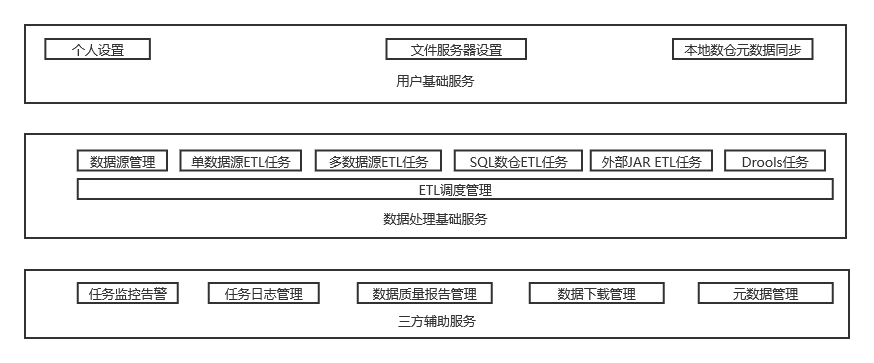
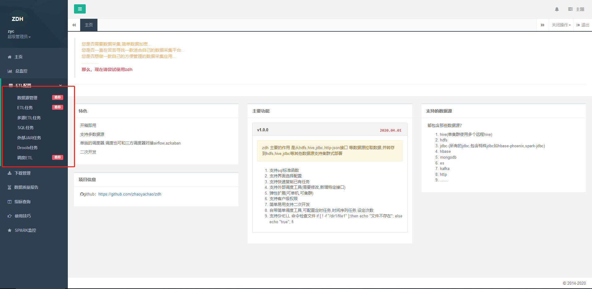
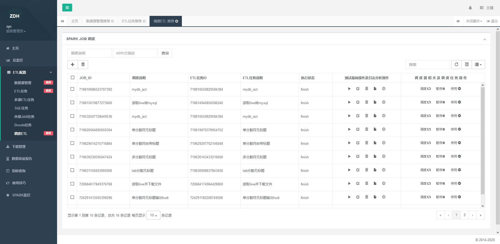

# Data acquisition, processing, monitoring, scheduling, management integration platform

# topic
   
    ZDH consists of two parts: front-end configuration + back-end data ETL processing. This part only includes front-end configuration
    Please see the project https://github.com/zhaoyachao/zdh_server.git backend data etl
    If zdh_Web chooses version 1.0,zdh_server is compatible with 1.x
    Please select the Dev branch for secondary development. The DEV branch will merge the master only if the test passes, so the master may not be up to date, but the availability can be guaranteed

# features
    Out of the box
    Support for multiple data sources
    High performance data acquisition
    Separate scheduler, scheduling can also and three sides scheduler docking airflow, azkaban
    Secondary development
    
   
# Usage scenarios
  + Data acquisition (local upload data, HDFS, JDBC, HTTP, Cassandra, directing, redis, kafka, hbase, es, SFTP, hive)
  + Data encryption
  + Data conversion, offline data synchronization, real-time data synchronization
  + Data migration
  + Quality inspection
  + Metadata, index management
  + Drools flexible and dynamic data cleansing
  
  
  
# The main function
 The main function of ZDH is to pull data from HDFS, Hive, JDBC, HTTP-JSON and other data sources, and transfer data to HDFS, Hive, JDBC and other data sources
 Supports cluster deployment
 
 
  + Support for SQL standard functions
  + Support interface selection configuration
  + supports fast replication of existing tasks
  + Support for external scheduling tools (need to modify, add a specific interface)
  + Elastic extension (single or clustered)
  + Support customer level permissions
  + Easy to use support secondary development
  + with its own simple scheduling tool, can be configured timing tasks, time series tasks, set times
  + Scheduling dependency
  + SQL Data warehouse data processing (single warehouse)
  + Quality inspection and corresponding report
  + Support SHELL command,SHELL script,JDBC query scheduling,HDFS query scheduling
  + Support local upload, download files
  + supports multi-source ETL
  + Task monitoring
  + Flexible dynamic Drools rule cleaning
  
# Functional diagram
  
  
# Version update instructions
   + v1.0 support JDBC, commonly used data hive, kafka, HTTP, flume, redis, es, kudu, directing, hbase, Cassandra, HDFS (CSV, json, orc, parquet, XML, excel...)., local upload data (CSV)
   + V1.0 scheduling supports task dependencies, etc
    
   + V1.1 supports Clickhouse-JDBC
     
   + V1.2 supports external JAR ETL tasks (task status requires external JARS to be tracked by themselves)
     
   + V1.3 supports Drools data cleansing
     
   + V1.4 supports Greenplum - JDBC
     
   + V2.0 removes external JAR task and replaces it with SSH task, and SSH task function is newly added
   + V2.0 Drools tasks added support for multi-source and SQL tasks
   + V2.0 Clickhouse, Hive Spark data source optimization
   + V2.0 Spark SFTP data framework changes to add SFTP Excel and multi-delimiter support
   + V2.0 scheduling retry mechanism optimization, add node failure resend function (task restart)
   + V2.0 adds the dispatching individual alarm mechanism
   + V2.0 Server module high availability mechanism changed to load high availability
   + V2.0 Hbase, Drools JAR conflict bug fix
   + V2.0 supports SSH task static script, dynamic script
   + V2.0 Kafka, Flume Real-time data source removal must use JDBC output source restrictions
   + V2.0 fixed spark monitoring bug, mobile Spark monitoring to the general monitoring
   + V2.1 Zdh_Web adds Redis Cluster support
   + v2.1 increase support JDBC presto, mariadb, memsql, huawei DWS, ali AnalyticDB, kylin, gbase, kingbase, redshift
     
   + V2.2 scheduling mechanism adds ACK, no sense of failover
   + V2.2 Optimize all front interface, add status highlight
   + V2.2 SQL editing supports highlighting
   + V2.2 Manual execution scheduling changed to asynchronous execution
   + V2.2 Task log fetch mode changed (time fetch changed to identifier + time fetch)
     
   + Visual optimization of front-end interface status of V3.0
   + V3.0 removes the task_logs task log table and adds the task_log_instance table as a replacement (Big Change 2.0 and 3.0 are completely incompatible)
   + V3.0 fixes favicon display bugs
   + V3.0 added scheduler failover
   + V3.0 monitoring interface added manual retry function
   + V3.0 split quartz_job_info dispatching task table. Each time the dispatching task is executed, an instance table of the current state will be generated (retry, failover, ACK, etc., all complete logical operations based on the instance table).
   + V3.0 adds the interface of single task parallel processing mechanism (only the implementation interface is left, but no concrete implementation is done, so single task parallel processing is not supported temporarily)
   + V3.0 ZDH_Web project to add scheduler ID (mainly used for failover to determine whether the task is triggered by failover)
   + V3.0 manually delete reset (an instance will be generated, so remove reset)
   + V3.0 manual execution, dispatching execution will remove the previous instance dependency (after manual execution, the correct scheduling time must be set manually)
   + V3.0 adds the function of killing back-end tasks of data acquisition
   + V3.0 adds a timeout warning task - only warning without killing
   + V3.0 Hbase removes Jersey related jars to resolve JAR conflicts
   + V3.0 batch delete add confirm delete pop-up
   + V3.0 modifies the Spark Task Job group specification format
     
   + V3.1 task dependency check implementation changes
   + V3.1 adds cron expression to generate pages
   + V3.1 filenames add dynamic Settings (generate specific rule filenames based on time)
   + V3.1 Basic parameter calibration at startup
   + V3.1 Quartz task priority setting
   + V3.1 added support for Quartz time trigger (both serial and parallel support)
   + New DAG tool class in V3.1 (Plan 3.2 supports DAG scheduling)
     
   + V4.0 to achieve scheduling drag and drop
   + V4.0 reimplements the task discovery mechanism
   + V4.0 adds task group, subtask concept to realize group task
   + V4.0 to achieve DAG scheduling
   + V4.0 to achieve the scheduling flow chart
   + V4.0 re-implement task type (4.x previous version is not compatible)
   + V4.0 adds greenplum- Spark connector
   + V4.0 brand new logic, worth a try
     
   + V4.1 Fixed the 4.0 schedule retry bug
   + V4.1 Fixed a bug in the 4.0 scheduling interface
   + V4.1 Time selection mechanism is re-implemented, and scheduling performance is improved
   + V4.1 Modify the monitoring interface remove group task monitoring button add subtask monitoring interface
     
   + V4.2 Fixed 4.1bug
   + V4.2 SQL script to add Chinese description
     
   + V4.3 Add molecular task retry mechanism
   + V4.3 Add the mechanism of manual execution of molecular tasks
   + V4.3 Increase subtask runtime dependency graph display
   + V4.3 Task state increases skip state
   + V4.3 Fix manual retry bug
   + V4.3 Remove the ZooKeeper toolkit
   + V4.3 Removes the [repeat execution] scheduling task mode
   + V4.3 Delete the MQ configuration information
  
# FAQ
  + Log level modification
    Modify the logback correlation level of the log file
     
  + Schedule serial parallel mode
    Serial mode: determines the last run status of the task
    Parallel mode: do not determine the last task status, the time will be automatically generated
     
  + data table structure in the SRC/main/resources/db SQL shall prevail
   
  + Hadoop, Hive and Hbase services that do not support reading Kerberos authentication for the time being are expected to implement Kerberos authentication in version 5.x
    
 
 # Supported data sources
   + local file
   + hive(A single cluster uses multiple remote Hive, as well as internal and external tables)
   + hdfs(csv,txt,json,orc,parquet,avro)
   + jdbc (All the JDBC, contain special JDBC as hbase - phoenix, spark - JDBC, click - house, greenplum, presto, mariadb, memsql, huawei DWS, ali AnalyticDB, kylin, gbase, kingbase and redshift)
   + hbase
   + mongodb
   + es
   + kafka
   + http
   + sftp
   + cassandra
   + redis
   + flume

# Source custom packaging
    
    Clean up the command :mvn clean
    Packaging orders : mvn package -Dmaven.test.skip=true

# how to run
    Find zdh_web.jar in the target directory
    perform java  -Dfile.encoding=utf-8 -jar zdh_web.jar
   

    

 
# Personal Contact information
    email：1209687056@qq.com
    
#  The online preview
    http://zycblog.cn:8081/login
    account：zyc
    password：123456
    
    Server resources are limited, the interface is only for preview, do not include data processing part, thank code friends leniency
    
# 界面预览   

 
 